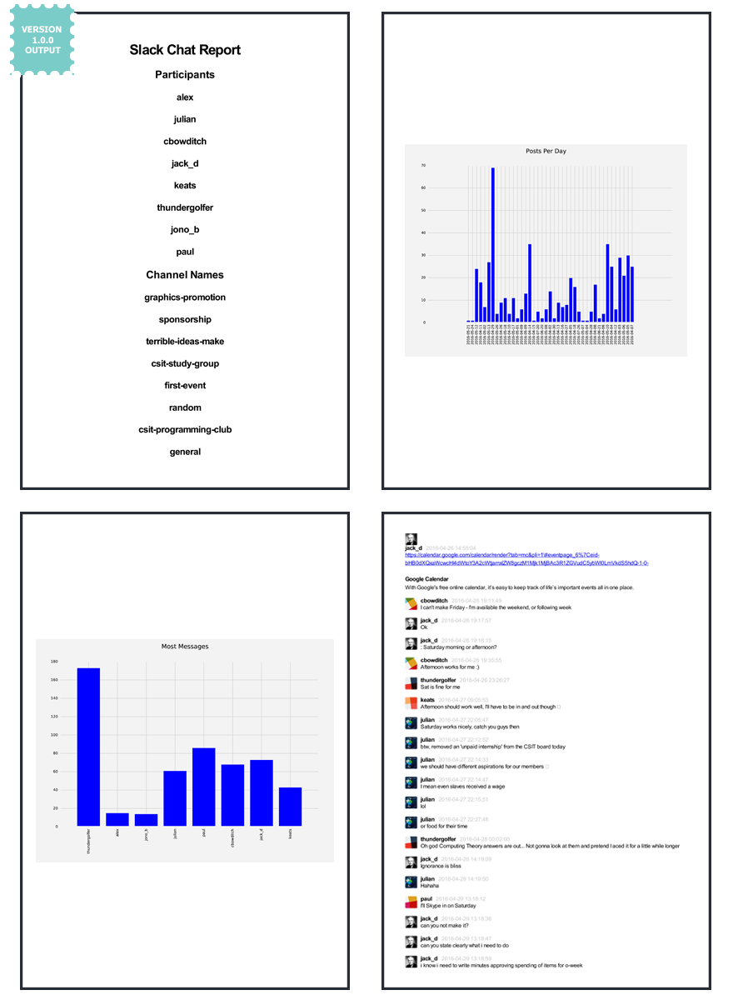

<p align="center">
  
</p>
# Slack To PDF Report

A Slack To PDF Report tool that allows you to easily view and share a report of your
Slack team's interactions (instead of having to dive into hundreds of JSON files).




## Overview

`slack-to-pdf` is best used to report the team interactions on Slack for a University/College assignment. Some group project assignments require you do log and present your communications to assess member contribution.

`slack-to-pdf` can be used locally on one machine for yourself to explore an export or it can be run on a headless server (as it is a Flask web app) if you also want to serve the content to the rest of your team.


## Usage

### 1) Grab your Slack team's export

* Visit [https://my.slack.com/services/export](https://my.slack.com/services/export)
* Create an export
* Wait for it to complete
* Refresh the page and download the export (.zip file) into whatever directory

### 2) Run the following command.

The `-z` flag is to give the .zip file to slack-to-pdf and let it do its magic

```bash
python app.py -z /path/to/export/example.zip
```

If everything went well, your archive will have been extracted, processed, and browser window will have opened showing your *#general* channel from the export.
You can **close the local server** and navigate to the project's root directory, where you will see a `Your_Report.pdf`, and you're done!


## Installation

Fork or Clone this repo to your computer, create a [virtualenv](http://docs.python-guide.org/en/latest/dev/virtualenvs/) to isolate your setup, and then once your
`env` is activated (for Windows run `<env-name>\Scripts\activate>`), run `pip install -r requirements.txt` from project root.

Everything should be ready to go.

#### Installing wkhtmltopdf

**WINDOWS:** If you are on *Windows* then wkhtmltopdf has already been installing in this project's folder and is ready to go.
**OSX:** Download and install the package [here](http://wkhtmltopdf.org/) and everything should work.
**UNIX:** Please follow the instruction [here](https://github.com/pdfkit/pdfkit/wiki/Installing-WKHTMLTOPDF)

Note: I will later work on making this process even easier for all OS Systems.

## Acknowledgements

* Credit to Pieter Levels for his original [blog post](https://levels.io/slack-export-to-html/) on a Slack-to-html solution.

* Credit to [Hamza Faran](https://github.com/hfaran) for his work on a Slack-to-HTML solution in python.

### License

[](http://creativecommons.org/publicdomain/zero/1.0/)

To the extent possible under law, [Thundergolfer](http://www.jonathonbelotti.com) has waived all copyright and related or neighboring rights to this work.
